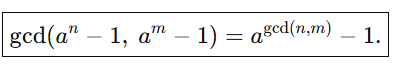

*문제 46번


******************************************************************************************
1로 이루어진 자연수를 공비가 10인 등비수열의 합으로 바꾸어 쓸 수 있다.

*등비수열 합공식 : 

등비수열 합공식을 이용하면 (10^n-1)/(10-1)로 쓸 수 있다.

이때, gcd(k*a, k*b) = k*gcd(a,b) 이고

* 

가 성립하므로 9*gcd(a^n - 1, a^m - 1) = a^{gcd(n, m)} - 1 이고

이항정리해서 우변을 (a^{gcd(n, m)} - 1)/(10-1) 형태로 바꾸면 다시 등비수열 합공식의 형태가 된다.

즉, 두 수의 최대공약수도 gcd(n, m)개의 1로 이루어진 자연수의 형태이다.

******************************************************************************************

*코드 구현
```python
def gcd(a, b):
    if b == 0:
        return a
    else:
        return gcd(b, a % b)

a, b = map(int, input().split())
result = gcd(a, b) 

while result > 0:
    print(1, end='')
    result -= 1
```