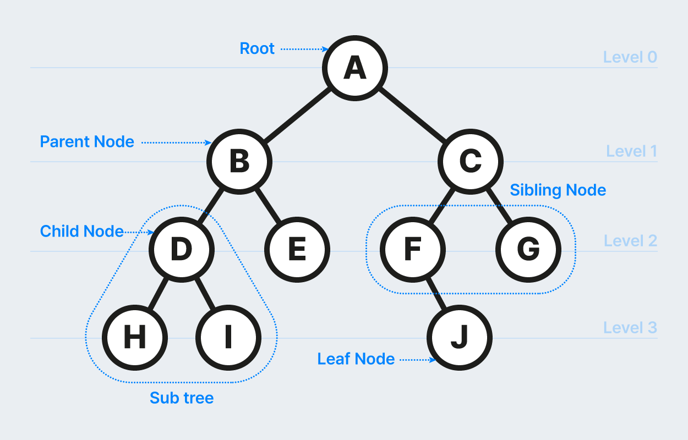

# 트리 알아보기

- 순환 구조를 지니고 있지 안혹, 1개의 루트 노드가 존재합니다.
- 루트 노드를 제외한 노드는 단 1개의 부모 노드를 갖습니다. 
- 트리의 부분트리(subtree) 역시 트리의 모든 특징을 따릅니다. 

## 트리의 핵심 이론

- 노드: 데이터의 index와 value를 표현하는 요소
- 에지: 노드와 노드의 연결 관계를 나타내는 선
- 루트 노드: 트리에서 가장 상위에 존재하는 노드
- 부모 노드: 두 노드 사이의 관계에서 상위 노드에 해당하는 노드
- 자식 노드: 두 노드 사이의 관계에서 하위 노드에 해당하는 노드
- 리프 노드: 트리에서 가장 하위에 존재하는 노드(자식 노드가 없는 노드)
- 서브 트리: 전체 트리에 속한 작은 트리

